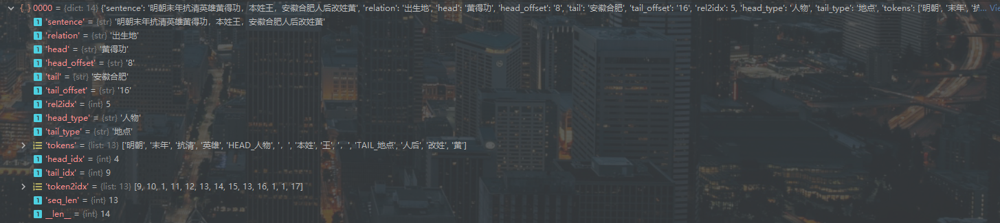

# DeepKE

DeepKE 是基于 Pytorch 的深度学习中文关系抽取处理套件。

# 代码运行说明：

> 基本运行方法：
>
> > 找到tools文件夹下的main.py直接运行即可
> >
> > 注：本项目下的代码是经过调试修改的，和原项目的运行说明是不一样的哈。


> 代码详细说明（按可理解的顺序说明的）
>
> > # 配置文件：
> >
> > - 配置文件位于config目录下，主配置文件为config.yaml，其主要的信息如下：
> >
> > ```yaml
> > - preprocess
> > - embedding
> > - train
> > - predict
> > - model: cnn   # [cnn, rnn, transformer, capsule, gcn, lm]
> > - override hydra/output: custom（这个不重要，规定一下日志格式等内容，想详细了解的请具体看hydra这个库的说明，当然了等看完代码再看这些细节的东西）
> > ```
> >
> > 上面配置文件的主要作用就是：他配置了一个模型训练需要的所有模块：数据处理模块，词嵌入向量配置，数据训练模块，预测模块，训练的模型模块。这些模块的配置信息也都是yaml文件保存在config文件夹下。
> >
> > - 配置文件的加载：
> >
> >   使用了hydra这个库来加载的yaml文件，加载语句位于tools/main.py文件里如下：
> >
> >   ```python
> >   @hydra.main(config_path='../conf',config_name='config.yaml')
> >   def main(cfg):
> >       cwd = utils.get_original_cwd()
> >       cwd = cwd[0:-5]
> >       cfg.cwd = cwd
> >       cfg.pos_size = 2 * cfg.pos_limit + 2
> >       logger.info(f'\n{OmegaConf.to_yaml(cfg)}')
> >     
> >   ```
> >
> >   加载方式为注解的方式@hydra.main(config_path='../conf',config_name='config.yaml')，使用这种方式来加载yaml文件的时候，首先他会找到config.yaml文件，然后对里面的内容解析，比如遇到里面的preprocess他就会找config.yaml同目录下的preprocess.yaml文件，如果遇到model:cnn 他就找config.yaml同目录的model文件夹，然后找到cnn.yaml文件来加载，其他的子目录里面的字段都是不带 - 的就不会解析为文件而是直接解析为变量。
> >
> > # 数据处理：
> >
> > - 本身提供的数据格式如下:
> >
> >   
> >
> > - 数据处理模块如下,位于main.py的48行：
> >
> >   ```python
> >   47 if cfg.preprocess:
> >   48    preprocess(cfg)
> >   ```
> >
> >   preprocess的主要功能就根据所有内容构建一个词库或者加载预训练的词库，然后把所有的sentence转换为序号编码，这个具体过程展示：
> >
> >   - 进行分词，并且把实体替换为类型，如tokens所示：
> >
> >   - 构建词库，进行序列化标注，这里会把新形成的一些词HEAD_人物等都归入到词库中的，不论是自己构造还是预训练的词库都是这样的：
> >
> >     在tools\preprocess.py里如下几个位置就可以看出来
> >
> >     ```python
> >     121    d['token2idx'] = tokenizer.encode(sent, add_special_tokens=True)
> >     122    d['seq_len'] = len(d['token2idx'])
> >         
> >     197    train_tokens = [d['tokens'] for d in train_data]
> >     198    valid_tokens = [d['tokens'] for d in valid_data]
> >     199    test_tokens = [d['tokens'] for d in test_data]
> >     200    sent_tokens = [*train_tokens, *valid_tokens, *test_tokens]
> >     201    for sent in sent_tokens:
> >     202        vocab.add_words(sent)
> >     ```
> >
> >     序号化标注之后的效果
> >
> >     
> >
> >     添加给句子的词添加位置信息：位置信息这里添加分为两步，第一步计算各个词与第一个实体词的相对位置，就是实体词为0则左边为-1，-2，..右边为1，2，3...之后将这个之加上配置文件里设定的值30+1来使它归正大于等于1，当然了第二个实体词也是这样的。此外哈加和超过设定值2两倍+1的都设置为0，这也是之前为什么加30+1，就是为了把0空出来用来表示过剩的部分，具体效果如下：
> >
> >     
> >
> >     然后将这一切保存为pkl格式的数据，使用的是python的pickle库，这个格式用来保存数据为二级制文件，可读性差，压缩效果好，保存东西暴力，所有python类型都能直接保存和加载回来，只适用于python.
> >
> > # 模型构建
> >
> > - PCNN模型
> >
> >   - Embeding:
> >
> >     - 首先我们构建词向量，词向量由三部分组成：wordEmbed（词嵌入），headPosEmbed（头部实体位置嵌入），tailPosEmbed（尾部实体位置嵌入），三部分有两种组成方式：加和和拼接。加和的话位置嵌入的向量大小和词嵌入的向量大小是一样的，拼接的话就是使用指定长度的位置嵌入向量就可以了。此外相加之后会使用LayerNorn在词向量的长度维度来归一化每个词向量，。
> >
> >   - model:
> >
> >     - PCNN（models/PCNN.py）
> >
> >       
> >
> >       - 1.进行卷积（module/CNN.py）：
> >         - 这里使用一维的卷积，对词向量化后的句子进行卷积操作，一维卷积核要知道移动方向为channel维度（这里就是word embedding 的维度），默认宽度也是channel的宽度（word embedding 的维度），长度自定义，这样每个卷积核操作后输出的都是一个一维向量，通过指定outputchannel就可以扩充wordembeding的维度了。（怎么画动图演示一下呀，好想呀。没找到办法。。）
> >         - 这里共使用了3个不同长度的卷积层来进行的卷积（这里是分别卷积的，不是依次卷积），然后在channel维度拼接在了一起，然后根据mask将padding的位置的词向量替换为一个很小的数。
> >         - 使用最大池化操作或者其他操作，结果的形状都一样。<u>**池化的方向和卷积方向不一样**</u>沿着句子长度的维度来的，池化后都是取一个值，池化核大小等于句子长度，所有的句子最后又成了一个一个的一维向量，也就是最后生成了句子的向量表示。
> >         - 最后使用dropout防止过拟合。
> >         - 到这里每句话的向量表示都出来了可以做分类了，下面PCNN模块是可选的一种增强方式。
> >       - 2.使用PCNN方法进行特征增强：
> >         - PCNN使用的情况是句子中只有两个实体，实体之间有距离不能靠着，实体离句子两边都有距离不能为0，然后根据实体的位置我们可以把句子分成三部分用如下方式标记，11112222233330000，1表示第一个实体之前（包含了第一个实体），2表示第一个和第二个实体之间，3表示第二实体之后，0表示的是padding
> >         - 然后使用embeding层来对这个序列进行向量化，这里设置的embeding的维度为3，vobsize为4
> >         - 之后将这个embeding的数据和output的数据使用广播机制合并，两个数据的词长度维度是相同的可以合并（感觉挺诡异的合并方式吧），然后又在每一个句子长度的维度进行最大池化得到和上面一样的输出向量三个300维的向量，然后对这个向量的后两位展平处理形成一维向量。
> >       - 3.全连接层进行预测：
> >         - 然后使用全连接层将数据输出到指定的类别个数个维度。然后就是计算损失了。
> >
> > 


 


## 主要目录

```
├── conf                      # 配置文件夹
│  ├── config.yaml            # 配置文件主入口
│  ├── preprocess.yaml        # 数据预处理配置
│  ├── train.yaml             # 训练过程参数配置
│  ├── hydra                  # log 日志输出目录配置
│  ├── embedding.yaml         # embeding 层配置
│  ├── model                  # 模型配置文件夹
│  │  ├── cnn.yaml            # cnn 模型参数配置
│  │  ├── rnn.yaml            # rnn 模型参数配置
│  │  ├── capsule.yaml        # capsule 模型参数配置
│  │  ├── transformer.yaml    # transformer 模型参数配置
│  │  ├── gcn.yaml            # gcn 模型参数配置
│  │  ├── lm.yaml             # lm 模型参数配置
├── pretrained                # 使用如 bert 等语言预训练模型时存放的参数
│  ├── vocab.txt              # BERT 模型词表
│  ├── config.json            # BERT 模型结构的配置文件
│  ├── pytorch_model.bin      # 预训练模型参数
├── data                      # 数据目录
│  ├── origin                 # 训练使用的原始数据集
│  │  ├── train.csv           # 训练数据集
│  │  ├── valid.csv           # 验证数据集
│  │  ├── test.csv            # 测试数据集
│  │  ├── relation.csv        # 关系种类
│  ├── out                    # 预处理数据后的存放目录
├── module                    # 可复用模块
│  ├── Embedding.py           # embedding 层
│  ├── CNN.py                 # cnn
│  ├── RNN.py                 # rnn
│  ├── Attention.py           # attention
│  ├── Transformer.py         # transformer
│  ├── Capsule.py             # capsule
│  ├── GCN.py                 # gcn
├── models                    # 模型目录
│  ├── BasicModule.py         # 模型基本配置
│  ├── PCNN.py                # PCNN / CNN 模型
│  ├── BiLSTM.py              # BiLSTM 模型
│  ├── Transformer.py         # Transformer 模型
│  ├── LM.py                  # Language Model 模型
│  ├── Capsule.py             # Capsule 模型
│  ├── GCN.py                 # GCN 模型
├── tools                     # 工具目录
│  ├── metrics.py             # 评测指标文件
│  ├── serializer.py          # 预处理数据过程序列化字符串文件
│  ├── preprocess.py          # 训练前预处理数据文件
│  ├── vocab.py               # token 词表构建函数文件
│  ├── dataset.py             # 训练过程中批处理数据文件
│  ├── trainer.py             # 训练验证迭代函数文件
│  ├── main.py                # 主入口文件（训练）
│  ├── predict.py             # 测试入口文件（测试）   
├── test                      # pytest 测试目录
├── tutorial-notebooks        # simple jupyter notebook tutorial
├── utils                     # 常用工具函数目录
│  ├── ioUtils.py             # io工具
│  ├── nnUtils.py             # 网络工具
├── README.md                 # read me 文件
```

## 快速开始

数据为 csv 文件，样式范例为：


sentence|relation|head|head_offset|tail|tail_offset
:---:|:---:|:---:|:---:|:---:|:---:
《岳父也是爹》是王军执导的电视剧，由马恩然、范明主演。|导演|岳父也是爹|1|王军|8
《九玄珠》是在纵横中文网连载的一部小说，作者是龙马。|连载网站|九玄珠|1|纵横中文网|7
提起杭州的美景，西湖总是第一个映入脑海的词语。|所在城市|西湖|8|杭州|2

- 安装依赖： `pip install -r requirements.txt`

- 存放数据：在 `data/origin` 文件夹下存放训练数据。训练文件主要有三个文件。更多数据建议使用百度数据库中[Knowledge Extraction](http://ai.baidu.com/broad/download)。

  - `train.csv`：存放训练数据集

  - `valid.csv`：存放验证数据集

  - `test.csv`：存放测试数据集

  - `relation.csv`：存放关系种类

- 开始训练：python main.py

- 每次训练的日志保存在 `logs` 文件夹内，模型结果保存在 `checkpoints` 文件夹内。

## 具体介绍

见 [wiki](https://github.com/zjunlp/deepke/wiki)


## 备注（常见问题）

1. 使用 Anaconda 时，建议添加国内镜像，下载速度更快。如[清华镜像](https://mirrors.tuna.tsinghua.edu.cn/help/anaconda/)。

1. 使用 pip 时，建议使用国内镜像，下载速度更快，如阿里云镜像。

1. 安装后提示 `ModuleNotFoundError: No module named 'past'`，输入命令 `pip install future` 即可解决。

1. 使用 `python main.py --help` 可以查看所有可配置参数，并定制修改参数结果。参数为 bool 值的，可以用 `1，0` 代替 `True, False`。

    - 如 `python main.py epoch=100 batch_size=128 use_gpu=False`

1. 使用 `python main.py xxx=xx,xx  -m` 可以多任务处理程序。

    - 如 `python main.py model=cnn,rnn,lm  chinese_split=0,1  -m` 可以生成 3*2=6 个子任务。

1. 中文英文在数据预处理上有很多不同之处，`serializer.py` 用来专门序列化句子为 tokens。中文分词使用的是 jieba 分词。

    - 英文序列化要求：大小写、特殊标点字符处理、特殊英文字符是否分词、是否做 word-piece 处理等。
    
    - 中文序列化要求：是否分词、遇到英文字母是否大小写处理、是否将英文单词拆分按照单独字母处理等。
    
1. PCNN 预处理时，需要按照 head tail 的位置，将句子分为三段，做 piece wise max pooling。如果句子本身无法分为三段，就无法用统一的预处理方式处理句子。
   
    - 比如句子为：`杭州西湖`，不管怎么分隔都不能分隔为三段。
    
    - 原文分隔三段的方式为：`[...head,  ...,  tail....]`，当然也可以分隔为：`[...,  head...tail,  ....]`，或者 `[...head,  ...tail,  ....]`  或者 `[...,  head...,  tail...]` 等。具体效果没多少区别。
    
1. PCNN 为什么不比 CNN 好，甚至更差？？

    - 本人在跑百度的数据集，也发现 PCNN 效果并没有想象中的比 CNN 有提升，甚至大多时候都不如 CNN 那种直接 max pooling的结果。百度的 [ARNOR](https://github.com/PaddlePaddle/models/tree/develop/PaddleNLP/Research/ACL2019-ARNOR) 结果也是 PCNN 并不一定比 CNN 好。

1. 使用语言预训练模型时，在线安装下载模型比较慢，更建议提前下载好，存放到 `pretrained` 文件夹内。具体存放文件要求见文件夹内的 `readme.md`。

1. 数据量较小时，直接使用如12层的 BERT，效果并不理想。此时可采取一些处理方式改善效果：
   
    - 数据量较小时层数调低些，如设置为2、3层。
    
    - 按照 BERT 训练方式，对新任务语料按照语言模型方式预训练。
    
1. 在单句上使用 GCN 时，需要先做句法分析，构建出词语之间的邻接矩阵（句法树相邻的边值设为1，不相邻为0）。
   
    - ~~目前使用的是 `pyhanlp` 工具构建语法树。这个工具需要按照 java 包，具体使用见 [pyhanlp](https://github.com/hankcs/pyhanlp) 的介绍。~~ pyhanlp 在多句时效果也不理想，很多时候把整个单句当作一个节点。	
