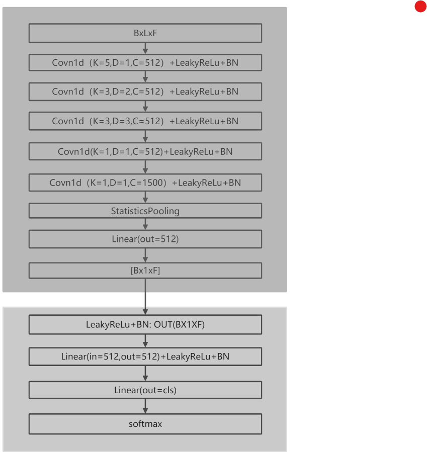

# 数据使用
The data we use is from Mini Librispeech + OpenRIR.

# 训练说明
- 一个命令
```
python train.py train.yaml
```
# 项目结构说明：
speechBrain训练代码只需要四个文件
* `train.py`: 训练模型
* `train.yaml`: 配置参数
* `custom_model.py`: 自定义模型
* `mini_librispeech_prepare.py`: 数据准备
* `inference.py`:模型调用
# Xvector模型说明



# 其他训练技巧
- 使用了环境增强方法，把一个batch的数据扩大了两倍，这样好。


# 代码过程讲解：
- 数据整理:
  - 这个框架处理语音的通用数据格式都是如下形式的:  唯一id:{ wav: , length:, spk_id:,}
所以要单独准备一个文件夹把准备的数据转换为如下的数据格式,并且划分好train,val,test三种文件.

- 模型准备
  - 模型单独的放到一个文件夹里即可,因为这里音频处理的数据格式是固定的[B,L,F], 所以我们只要把模型写好,使用input_feats = torch.rand([5, 10, 40])产生一个固定大小的数据集进行测试即可.

- 编写train.py和hyperparameters.yaml脚本进行训练
  - trian.py文件包含了从数据准备,到dataloader构建,到模型训练的全过程内容,其中的各种参数全部从配置文件中读取,这个模式是固定的,所以多为套用微调内容即可train.py的流程如下:
    -  超参数读取
    -  创建实验环境,保存实验结果
    -  进行数据格式处理
    -  准备dataset
    -  构建sb.Brain类的对象
    -  进行训练 train,val
    -  进行测试 test
    -  其中dataset,和sb.Brain需要自定义

- 总结:一个模型构建过程中重要的几步如下:
  - 确定好模型的输入,输入的数据格式,比如所有的音频模型输入的格式都是[B,C,F],文本为[B,C,F]等
    - 根据这个输入,把已有的数据信息整理到json,csv里,然后读取这些文件,然后构建dataloader把数据读取进来,在读取的过程中把他转为需要的数据格式[B,C,F]
    - 确定好模型的输出,输出数据格式跟标签的样式有关,一般输出就是调整最后全连接的维度或者卷积的个数让他等于标签的长度即可
  - 根据这个输出和标签要选择适合的损失函数来计算损失
  - 确定好输入输出就可用模拟的数据来写模型和调试模型,这里可以看出模型是否可以正常接收参数,输出是否正确,然后中间过程是否正确
  - 模型书写完毕就可以进行模型训练了,使用train.py把整个训练过程的具体步骤(超参数环境配置,数据读取处理,训练,测试)整合好.

使用这个框架重要的是知道这个模型的组织结构，如何工作的，对于代码的模型内容部分看图和调试即可明白，其他的代码说明都在代码的注释里

# Template for Speaker Identification
  
This folder provides a working, well-documented example for training
a speaker identification model from scratch, based on a few hours of
data. The data we use is from Mini Librispeech + OpenRIR.

There are four files here:

* `train.py`: the main code file, outlines the entire training process.
* `train.yaml`: the hyperparameters file, sets all parameters of execution.
* `custom_model.py`: A file containing the definition of a PyTorch module.
* `mini_librispeech_prepare.py`: If necessary, downloads and prepares data manifests.


[For more information, please take a look into the "speaker-id from scratch" tutorial](https://colab.research.google.com/drive/1UwisnAjr8nQF3UnrkIJ4abBMAWzVwBMh?usp=sharing)